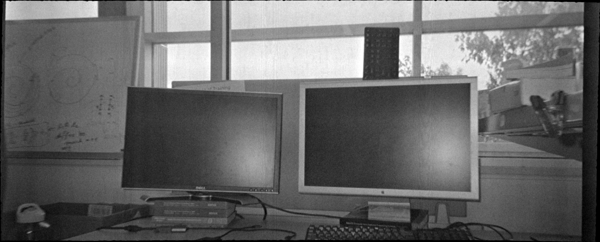
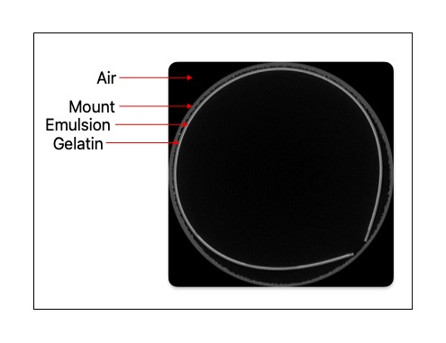
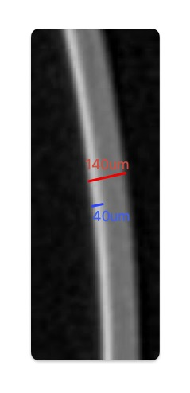

# Film Restoration Data collection and archieving


This sub-repository is for data creation and data handling. This sub-repository will do the following:

- Deals with scanning the Film data
- Unwrapping them films virtually and registering them with the optical data
- Making the [`Dataset`](https://pytorch.org/tutorials/beginner/basics/data_tutorial.html)

The folder named [media](./media) have the necessary diagrams and figure for explaining and coumenting this repository.

## About the data

The data is basically black and white 35mm film negatives from Ilford. These film negatives have base of Cellulose Acetate. We used a [Single-use Ilford 35mm point and shoot film camera](https://www.bhphotovideo.com/c/product/906263-REG/ilford_1174168_hp_5_plus_single_use.html/?ap=y&ap=y&smp=y&smp=y&store=420&lsft=BI%3A514&gad_source=1&gbraid=0AAAAAD7yMh1DVbO-pO1SMblJDb3QnAe9y&gclid=Cj0KCQjw_JzABhC2ARIsAPe3ynprAkHMB3UhmDwUgpBPw3CS5bkr8R0a7xeYWfiT26kRVtaIQQlRQyQaAt7OEALw_wcB) to take pictures of natural images of buildings, trees, and similar things. The camera has an aperture of f/9.5 and focal length of 30mm, and the film has an ISO of 400, with 27 exposures. Once we capture all the images, we send the camera to develop the film negatives to [THE DARKROOM](https://thedarkroom.com/?gad_source=1&gbraid=0AAAAAD_QVtmqLIPixAOewvZILGNeG1XDh&gclid=Cj0KCQjw_JzABhC2ARIsAPe3ynpmGXG8IHQhZgXm8cAXvLPrJYQo6qqNmeyQUNgpNU4vqNxjW1f18F0aAo9JEALw_wcB) to get the film developed and a super-resolution digital image. The super-resolution is [4492&times;6774](https://thedarkroom.com/scans/#:~:text=Super%20Scans%20are%204492×,default%20to%20the%20shortest%20dimension.).

There are about 20 frames to be scanned. After scanning, the rendered image is approximately 3732&times;1511.
Rendered from CT-Scan (3732&times;1511)            |  Digital image (4492&times;6774)
:-------------------------:|:-------------------------:
  |  

The above is an example of one of the images, showing a comparison of the rendered image, after segmenting, flattening and max-filtering on the left, and the developed digital image on the right.

## Scanning mount

The scanning mount is made by 3D printing using Nylon-11 using Multi-Jet Fusion (MJF) technology and the vapour polishing it. We used the [Xometry](https://www.xometry.com) 3D printing facility. 

## Scan protocol

We are using a micro-CT scanner named [SKYSCAN 1273](https://www.microphotonics.com/products/skyscan-1273/?gad_source=1&gbraid=0AAAAAD3S3B2QuPodgDBlfs7KxkPUgQmTH&gclid=Cj0KCQjw_JzABhC2ARIsAPe3ynqYqdmX3Hqahe6UjsMUkvmqDNq5EeDHVqJCxzmYp3XDas8xCLclCH4aAomsEALw_wcB). 

| Characteristic | Value |
|---------|------|
| Voltage | 60kV |
|Spot size | Medium spot |
|Frame average | 2 |
|Rotation angle | 0.150&deg; |
|360&deg; | ✅ |
|Resolution | 10&mu;m |
|Vertical position | 192mm |
|Diameter of the object | 15mm |
|Height of the object | 35mm |

## Post-processing


### Film scanning process
- Roll the film and put it into the mount and assign it an ID
- Correct the flat fielding if necessary before scanning (50% Avg with FF-off and empty FOV, 85% Max with FF-on and empty FOV, 40-60% Min with object of interest to be scanned in FOV)
- Set the protocol and scan it. For SKYSCAN it takes 1hr 20 mins to 1hr 30 mins on an average.
- After the scan is done:
- Take out the film
    - Frame it back with the corresponding ID
    - Take out a new film and redo till here from Step-1
    - The projections are saved under the folder type:
    `[Mount type]/FrameAvg/[ID]/[ID]_IBW_10um_60kV_MS`

### What to do with the films after scanning

- Import the projection into `NRecon`
- Check the misplacement and compensate for it (if needed)
- Preview few slices of reconstruction and fix the Histogram for better dynamic range
- Save the recon-files as `TIF(16 bit)` with a circular ROI, under `[Mount type]/FrameAvg/[ID]/[ID]_IBW_10um_60kV_MS/[ID]_IBW_10um_60kV_MS_Rec_ROI`

### What to do after CT-reconstruction

- Backup the projection data to the Seagate 24TB external HDD and delete it from the SKYSCAN Desktop
- Take the ROI-reconstruction data into an external SSD
- Convert that into `*.volpkg` using the following command using [`volume-cartographer](https://github.com/educelab/volume-cartographer):
```shell
vc_packager -v volpkgs/001_IBW_10um_60kV_MS.volpkg --name 001_IBW_10um_60kV_MS -m 140 -s Reconstructions/001/001_IBW_10um_60kV_MS_Rec_ROI/001_IBW_10um_60kV_MS__rec.log -n roi -u 10
```
- Open VC and do the segmentation:
- For slices 0-5, use LRPS with window size of “15”
- Then from 5-1509, use window size of “5”
- After segmentation is done, do the rendering in the following way:
    - Save the `*.obj` file (it will have a `*tif`, a `*.mtl` and a `*.obj` file)
    - Save the `*.ppm` file
    - Save the composites:
        - Max
        - Average/Mean
        - Median
    - Layers
    - Find and save the corresponding optical image
- After rendering is done, register the optical image with the max-composite render
- The final data for ML model training and data release should look like this in file structure:

    ```shell
    IlfordBW
    ├── ID
        ├── layers          # contains `ID_00.png`, `ID_01.png`, …, `ID_13.png`
        ├── match           # contains `ID_optical.jpg`, `ID_register.tif`
        ├── obj             # contains `ID.obj`, `ID.mtl` and `ID.tif`
        ├── ppm             # contains `ID_….tif`, `*.png`, `*.ppm`
        └── render          # contains `ID_max.tif`, `ID_mean.tif`, `ID_median.tif`
    ```
- A shell script should be made to create the above directory

## Preliminary analysis

As a preliminary analysis of the data, we see how a slice looks. Then label the slices to understand the film structure better and what information does the scan convey.

### Viewing the slice

The first slice for the film ID:`001` looks like this:


The image is labelled. The white part of the film is the emulsion, which is responsible for the images formed after developing the film negative. Now, as of analysis, let us measure the thickness of the film and the thickness of the emulsion.


From the image we can see that the thickness of the film is ~140&mu;m and the emulsion is ~40&mu;m. So, 30% of the thivkness of the film is emulsion.

<div style="text-align:center"></div>
